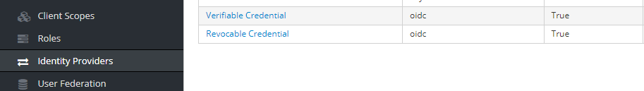
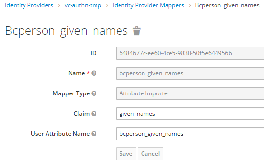
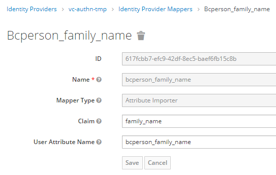
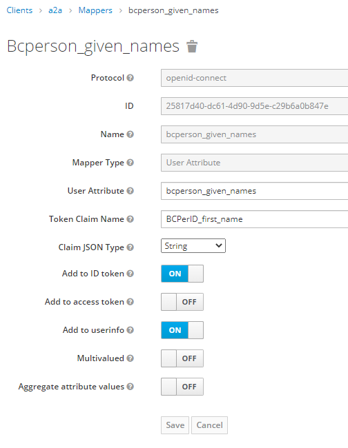
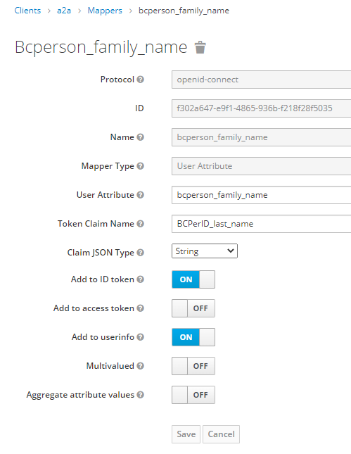

# Accredited Lawyer Presentation Requests

There are two versions of the presentation request, uniquely identified by their presentation `id`.  Additionally there are separate instances of each for the various environments (`dev`, `test`, `prod`).  ACM (aka A2A) identifies which presentation request it accepts by setting its `keycloak-pres-req-conf-id` configuration property to the presentation `id` of the desired presentation request.

## accredited-lawyer

This request asks the user to present attributes from their LSBC Member Certificate credential.

## accredited-lawyer-bcpc

This request asks the user to present attributes from their LSBC Member Certificate credential, along with the name attributes from their BC Person Credential.

## Updating KeyCloak mappings for new attributes.

### Update the mappings for the identity providers

#### Create the following new mappings for each IDP.

The ids of the mapping entries will be unique to the KeyCloak instance to which they are added.

#### Create the following new mappings for the client

The ids of the mapping entries will be unique to the KeyCloak instance to which they are added.

